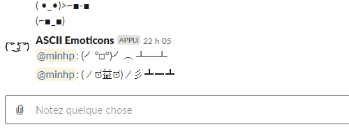

# slack-ascii-emoticons

slack-ascii-emoticons is a Slack app to send ASCII emoticons. (Technically, it should be called Unicode art.)

## Demo



## Installation

- Install [serverless](https://www.npmjs.com/package/serverless)
- Install the dependencies
  ```
  yarn install
  ```
- Deploy with `serverless`
  ```
  serverless deploy
  ```
- Note the output of the previous command, there should be something like
  ```
  endpoints:
    POST - https://********.execute-api.us-west-2.amazonaws.com/dev/webhook
  ```
- Create a Slack app with a [slash command](https://api.slack.com/interactivity/slash-commands),
  with the scope [chat:write:bot](https://api.slack.com/scopes/chat:write:bot),
  or [chat:write](https://api.slack.com/scopes/chat:write). Assign the URL above to the slash command's request URL.

## Usage

- To get the list of all available emoticons
  ```
  /<slash command> help
  ```
- To send an emoticon
  ```
  /<slash command> <emoticon name>
  ```
- To add/remove emoticons, you just need to edit `src/emoMapping.ts` and redeploy, or edit `src/emoMapping.js` directly in the Lambda console.

## Contributing

Pull requests are welcome. For major changes, please open an issue first to discuss what you would like to change.

## License

[MIT](https://choosealicense.com/licenses/mit/)
